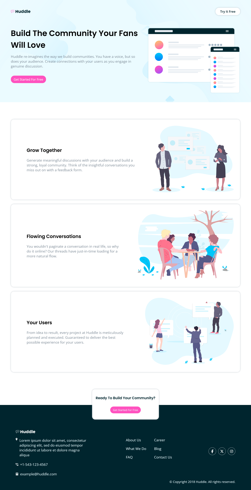
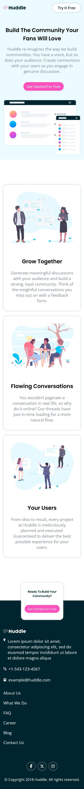

# Frontend Mentor - Huddle landing page with alternating feature blocks solution

This is a solution to the [Huddle landing page with alternating feature blocks challenge on Frontend Mentor](https://www.frontendmentor.io/challenges/huddle-landing-page-with-alternating-feature-blocks-5ca5f5981e82137ec91a5100). Frontend Mentor challenges help you improve your coding skills by building realistic projects. 

## Table of contents

- [Overview](#overview)
  - [The challenge](#the-challenge)
  - [Screenshot](#screenshot)
  - [Links](#links)
- [My process](#my-process)
  - [Built with](#built-with)
  - [What I learned](#what-i-learned)
  - [Continued development](#continued-development)
  - [Useful resources](#useful-resources)
- [Author](#author)
- [Acknowledgments](#acknowledgments)


## Overview

### The challenge

Users should be able to:

- View the optimal layout for the site depending on their device's screen size
- See hover states for all interactive elements on the page

### Screenshot







### Links

- Solution URL: [Solution URL here](https://your-solution-url.com)
- Live Site URL: [Live site URL here](https://your-live-site-url.com)

## My process

### Built with

- Semantic HTML5 markup
- CSS custom properties
- Flexbox
- CSS Grid
- Mobile-first workflow
- BEM


### What I learned


```css
.footer__social a:hover {
  filter: invert(49%) sepia(67%) saturate(2274%) hue-rotate(294deg) brightness(101%) contrast(102%);
}
```


### Continued development

- The footer 


### Useful resources

- [Stackoverflow](https://www.stackoverflow.com)
- [Modzilla Developer Network](https://developer.mozilla.org/en) 

## Author


- Frontend Mentor - [@limsael](https://www.frontendmentor.io/profile/limsael)
- Twitter - [@limsael525](https://www.twitter.com/limsael525)


## Acknowledgments

- [Stackoverflow](https://stackoverflow.com)

- [Google](https://google.com)